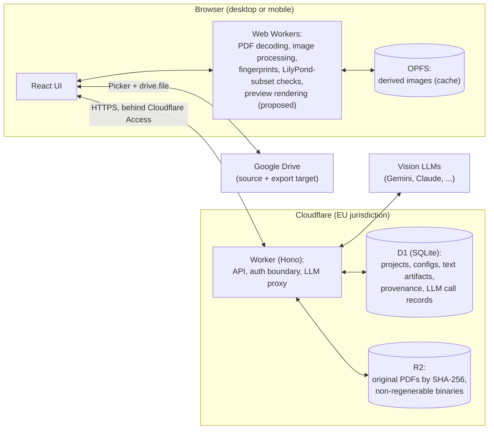

# Design Document — Score-to-LilyPond Pipeline (v2)

> Status: draft. The early assessment (§16 steps 1–4) is done and the app is being built from the outside inwards (§16 step 6): projects, the project picker and the project view exist and run locally; there are no pipeline stages yet. The findings in `NOTES-2026-10-formats.md` still have to be folded into this document (§16 step 5). This document records the architecture, the reasons behind it, and the known risks with proposed mitigations. Items marked **Proposed** are leading candidates, not final decisions. Concrete **tasks**, including the decisions still to be made, are collected in §15.

## 1. What this app is

A web app that converts PDFs of music scores into **LilyPond source code**.

- **Input:** a PDF, usually a scan of an old score, sometimes a digitally typeset (vector) PDF.
- **Output:** LilyPond source, optionally with an engraved rendering for side-by-side comparison with the original.
- **Focus:** the **pipeline**, not just the end result.
  - Every step is configurable.
  - Every intermediate input and output can be inspected.
  - Any part of the pipeline can be re-run from the first stage that went wrong, with a different configuration.
  - Any intermediate artifact can be edited by hand, and the pipeline resumes from the edited version.
- **Recognition is done by vision LLMs** (e.g. Gemini, Claude), steered by programmatic steps and human assistance. Programmatic steps handle the deterministic work: image handling, structure, checks, assembly. Humans assist where machines are unreliable, for example cropping heavily ornamented old scores.

### Lessons from v1
v1 was Python-only, local-only and command-line-only.

**What failed:** heavy programmatic preprocessing (cropping, deskewing, stain removal) followed by Audiveris (MusicXML) and `musicxml2ly`.
- Ornamented old scores were impossible to handle with scripts.
- Audiveris failed badly on them.

**What carries over:**
- The stage-tracking system: detecting finished stages, resuming interrupted runs, re-running stages, with hash checks and JSON documentation. It is the basis for §5.
- The LilyPond output conventions in §7.3.

**Where v2 starts from:** experience from other projects shows that current vision LLMs read difficult material very well, at a cost of cents per call.

### Scope
- **Focus:** classical piano scores. This is hard enough already, because it involves:
  - multiple voices per staff
  - the staff count changing mid-piece (e.g. 3 staves in a passage, 2 elsewhere)
  - lyrics below systems
  - editorial notes, ossia and alternative versions
  - a reduction staff for an orchestral part
  - two-piano double systems
- **Also possible:** other instrumentations are not excluded, but they are not optimized for initially.
- **Possible later: image input (PNG, JPEG)** in addition to PDFs. It is almost no extra work: an image is a page image, so it skips PDF extraction and joins the same pipeline at stage 1 (§6), with JPEGs going through the same bundled decoder (§8.1).

### Goals
- **Quality first:** the measure of success is how good the LilyPond is and how little human correction it needs. Infrastructure only exists to serve that.
- **Cheap:** runs on free tiers. Paid LLM calls are the only expected running cost.
- **Transparent:** open source, simple deployment, documented strategy (this file).
- **Runnable from anywhere:** start on the desktop, continue on the phone. Every pipeline stage should work on both.
- **Reproducible and testable:** every artifact can be traced back to its inputs, code version, prompt version, model and configuration. Non-deterministic parts (LLM calls, human input) are recorded so they can be replayed (§12).

### Non-goals (for now)
- Multiple users, sharing, collaboration. Each person deploys their own instance to their own Cloudflare account, with their own secrets, so the app has no user accounts and none are planned.
- MusicXML output.
- Offline-first operation.

## 2. Architecture overview



### Where data lives

| Data | Location | Why |
|---|---|---|
| Original PDFs | R2, key = SHA-256 of the file bytes | Source of truth. About 0.66 GB for 200 PDFs, well within R2's 10 GB free tier. Identifying PDFs by content makes deduplication and "resume an existing project?" trivial. |
| Projects, step configs, provenance, fingerprints | D1 | Small, structured, relational. SQLite is easy to inspect and migrate. |
| Text artifacts (analysis JSON, LilyPond fragments, review findings, human operations) | D1 | Small, must never be lost, often not reproducible. |
| LLM call records (full request + response) | D1 (large payloads in R2) | Needed for provenance, cost tracking and replay tests (§12). |
| Derived images (page images, preprocessed pages, system crops) | OPFS on the current device | Large (roughly 150–300 MB per PDF in colour, a third of that in grayscale) but regenerable from the PDF plus the recipe. Device-local means real deletion, no cloud quota, and no data residency issue. |
| Final exports (LilyPond, optional engraved PDF) | Download, or an app-created folder in Google Drive | The user's own file space. Browsable anywhere. |

### Why this split
- **No server-side compute.** Workers have tight CPU limits and no native libraries. All heavy processing happens in the browser, so the Worker stays a thin API and LLM proxy, and stays on the free tier. Waiting on an LLM response doesn't consume Worker CPU time.
- **Images are cache, not data.** This removes the biggest storage cost entirely. Switching devices costs some regeneration time, not storage.
- **Everything persistent is small** (text in D1) or **content-addressed and immutable** (PDFs in R2).

## 3. Technology decisions

| Area | Choice | Reason |
|---|---|---|
| Language | TypeScript everywhere | One set of types shared by the UI, the processing code, the Worker and the DB rows. The v1 Python code is being rewritten anyway. |
| Frontend | React + Vite | Familiar. Deploys to Cloudflare as static assets without changes. |
| Backend | Cloudflare Worker, HTTP layer on Hono | Web-standard `Request`/`Response`, minimal and portable. |
| Database | Cloudflare D1, created with `--jurisdiction eu` | SQLite semantics, free tier, EU data residency. The jurisdiction can only be set at creation. |
| Object storage | Cloudflare R2, bucket created with EU jurisdiction | 10 GB free, no egress fees, native Worker binding. The jurisdiction can only be set at creation. |
| Auth | Cloudflare Access in front of the whole app | No auth code in the app. |
| Device storage | OPFS (Origin Private File System) | Supported by Firefox, Chrome and Safari. Fast binary access from Web Workers. |
| PDF handling | pdf.js, version pinned | Renders vector PDFs and decodes CCITT/JBIG2 images in JS, deterministically. |
| JPEG decoding | Bundled JS/WASM decoder (e.g. libjpeg-turbo WASM, jpeg-js), not the browser's | Browser JPEG decoders may differ by about ±1 gray level. A bundled decoder gives identical pixels everywhere. |
| Vision LLMs | The user's choice, per stage (§7.6). Recommended: Claude Opus 5.5 for everything. | In the manual run (§16 step 3) Opus did best at everything, layout included. Providers are swappable behind the `LlmProvider` port. |
| Structured LLM output | Provider-native schema-constrained output, validated with Zod | Machine-checkable outputs. No free-form parsing. |
| Schema validation | Zod (or similar) | Validates step configs, LLM outputs and DB payloads. The same schema generates the UI controls (toggles, sliders). |
| Preview rendering | **Proposed:** Verovio (WASM) in the browser, fed by a TS converter from our constrained LilyPond subset | Keeps review and preview rendering runnable everywhere. See §9. |
| Google Drive | Google Identity Services + Google Picker + `drive.file` scope, entirely in the browser | `drive.file` is non-sensitive: no app verification, and access only to files the user picks or the app creates. |
| Local development | `wrangler dev` (local D1/R2 emulation) + Vite dev server, run as two processes. Vite proxies `/api` to Wrangler. No Cloudflare Vite plugin. | One code path from day 1. Keeps the app and the Worker as separate packages with a clear boundary. |
| Deployment | One Worker with static assets: `apps/worker`'s Wrangler config serves `apps/web`'s build output. `wrangler deploy` uploads both. | One origin: no CORS, one Access policy, app and API always deployed at the same version. |
| Tests | Vitest | Pure-TS core runs in Node for unit, golden-image and replay tests. |

### Repository layout (suggested)

```
packages/
  core/      Pipeline engine, artifact model, step definitions, config schemas.
             Pure TypeScript, no DOM and no Cloudflare APIs.
  imaging/   Decoders, deterministic image operations, fingerprints. Pure TS/WASM.
  notation/  Constrained-LilyPond parser, structural checks, skeleton builder,
             assembler, converter for preview rendering.
  prompts/   Versioned prompt templates and their output schemas.
apps/
  web/       React UI, Web Worker host, OPFS + Drive + local-file adapters.
  worker/    Hono API, D1 + R2 adapters, LLM provider adapters.
  eval/      Local evaluation tooling: engrave command, side-by-side viewer (§13).
fixtures/    Recorded test projects (§12).
testset/     Evaluation test set (§13): inputs, their strokes and .ly/.musicxml candidates committed, rest ignored.
DESIGN.md
```

### Ports and adapters

The core depends only on interfaces. Adapters live in `apps/*`.

| Port | Adapters |
|---|---|
| `PdfSource` | Local file input, Google Drive (Picker) |
| `BlobStore` (original PDFs) | R2 via the Worker. In-memory for tests. |
| `ProjectStore` (projects, artifacts, provenance) | D1 via the Worker. SQLite or in-memory for tests. |
| `DerivativeCache` (regenerable images) | OPFS. In-memory for tests. |
| `LlmProvider` | One adapter per provider (via the Worker). **Replay** adapter for tests. |
| `Renderer` | **Proposed:** Verovio in the browser. Optional: LilyPond (local install, container). See §9. |
| `ExportTarget` | Browser download, Google Drive folder |

## 4. Identity and projects

- A PDF is identified by the **SHA-256 of its bytes**, computed on the device with `crypto.subtle.digest` **before** uploading.
- When a PDF is selected, the app asks D1 whether the hash exists:
  - **Unknown:** upload to R2 at `pdfs/<sha256>.pdf` and create a project.
  - **Known:** offer to resume an existing project on this PDF, or start a new one. There can be several projects per PDF.
- The file name and source (Drive ID, local path) are stored as informational metadata only, never as identity.
- Each project has a **name**, so the user can tell projects on the same PDF apart (e.g. "Sonata, Claude run" vs "Sonata, Gemini run"). The name is a label, not the identity (that is the project ID), but it is unique so it can be relied on:
  - It defaults to the PDF's file name without ".pdf". If a project already has that name, the Worker appends " (1)", " (2)", ... and takes the first free one, like file managers do. A file that is already called `Sonata (1).pdf` becomes `Sonata (1) (1)`, also like file managers.
  - Uniqueness is case-insensitive ("Sonata" and "sonata" clash) and enforced by the database (`UNIQUE COLLATE NOCASE`), so two projects created at once can't get the same name. Names are trimmed, never empty, and at most 200 characters.
  - The user can rename a project at any time ("Rename" in the project actions, §5.6). Renaming to a name that is taken is refused with a message, not numbered: numbering only applies to the default. Changing only the case of the project's own name is allowed.
  - Deleting a project frees its name.
- **Deleting a project** (planned) keeps a trace in D1 but removes everything else:
  - **Deleted:** the project's artifacts and its PDF, in D1, R2 and the device cache, unless another project that isn't deleted still uses them. That is checked with a query at deletion time, not with stored reference counts, which can drift.
  - **Kept:** the project's row, marked with a deletion time (`deleted_at`), and its entries in the cost ledger (§10).
  - A deleted project never appears in the UI again, except in the costs view. Picking its PDF again doesn't trigger the "already based on this file" dialog, unless other projects use that PDF.
  - Uniqueness of names only counts projects that aren't deleted: a partial unique index (`... WHERE deleted_at IS NULL`). The current constraint sits on the column and can't be dropped, so the migration rebuilds the table.
  - Behind several confirmations.
- Each project also has three timestamps, all set by the Worker (ISO 8601, UTC) so a wrong device clock can't scramble the order:
  - **created**
  - **last modified:** any change to the project's own data (pipeline results, manual stages, a rename). Opening or viewing doesn't count.
  - **last opened:** set by a dedicated request when the project is opened, so listing projects doesn't touch it.

  Both start equal to the creation time, so sorting needs no special case for "never".
- Concurrent edits from two devices are prevented by optimistic locking: each project has a version number, and stale writes are rejected with a reload prompt.

## 5. The pipeline model

The pipeline is designed like a small build system. The v1 stage-tracking system (hash checks, resumability, JSON documentation) is the starting point and is ported, not reinvented.

### 5.1 Steps and stages

- A **step** is a definition in the code: what is done, with which configuration options.
- A **stage** is one occurrence of a step in a project's pipeline, with its own configuration and its own results.
- A project's **pipeline** is the ordered list of its stages. It is stored in D1 and shown in the UI (probably in a side panel), so it has to stay short.

There are two sorts of stages:
- **Planned stages** have a predefined order (§6) and can run automatically, one after the other.
- **Manual stages** are added by the user to intervene by hand (§5.4). They are recorded in the pipeline like any other stage.

The same step can occur more than once in a pipeline. Example: the review step run twice for extra accuracy, or once with one model and once more with another.

#### Run modes
A small picker in the pipeline panel sets, per project, how the pipeline runs:
- **Auto:** one click starts the pipeline (or resumes it), and it keeps going from stage to stage, following the recipe, until it is done or fails. If a model flags that it would like human input, the flag is recorded, but the pipeline goes on with the model's best guess. The spending cap (§10) also stops it.
- **Manual:** each stage is started by a click. This leaves time to look at the outputs and decide whether to step in with a manual stage or to run a stage again with other parameters.
- Far in the future, perhaps a middle ground: run automatically, but stop when a model asks for human input.

The mode for new projects is a settings item. After installation it is "Auto".

The browser drives the pipeline, so in either mode a run only advances while the app is open (§15, §16).

Each step declares:
- `id` and `version`, e.g. `transcribe_system@3` (see §11).
- A **config schema** (Zod), which is also the source of its UI controls.
- **Input** and **output artifact types**.
- **Granularity:** per document, per page, or per system. Steps can fan out, e.g. one page becomes many systems.
- Its **kind:** `deterministic` (code), `llm`, or `human`.
- Its **runtime:** browser (Web Worker) or Worker proxy (LLM calls).

### 5.2 Artifacts and provenance

Every step output is an artifact with:
- `step id@version`
- a canonical config hash (JSON with sorted keys)
- the IDs of its input artifacts
- its `origin` (`computed` | `llm` | `manual` | `imported`)
- a fingerprint (for images, see §8.3)
- a timestamp

LLM artifacts additionally reference their **call record**: prompt template version, filled-in context, image hashes, exact model ID, parameters, full response, token usage and cost.

A **cache key** = hash(step id, version, canonical config, input artifact IDs).
- Re-running a step with identical inputs and config hits the cache.
- Artifacts of later stages may already exist when an earlier stage is run again with the same inputs and config. They are found through the cache key and reused.

Every artifact has a row in D1, which belongs to the stage that produced it and says whether the artifact's content is stored (and where: D1 or R2) or only its recipe (§5.3).

### 5.3 Persisted vs. regenerable (important)

- **Deterministic** artifacts (page images, preprocessing, crops, assembly) store only their **recipe plus fingerprint**. Images live in OPFS and can be regenerated. Small text outputs may be stored anyway for convenience.
- **LLM** and **human** artifacts **must be persisted**. They cannot be regenerated: re-running an LLM call gives a different answer and costs money.
- Rule: *anything you would hate to lose must never exist only as a cached image.*

### 5.4 Manual stages

The user intervenes by adding a manual stage to the pipeline. The manual stages foreseen so far:
- fix deskewing angles
- fix content crops
- fix system crops
- fix measure crops
- fix extracted metadata (composer, title, edition etc.)
- fix musical content: at any point after the first transcription, before and/or after any review stage
- answer questions about uncertainties that a model flagged

Rules:
- **One manual stage covers the whole PDF,** however many items are fixed in it. Fixing twelve measure crops is one "fix measure crops" stage, not twelve. Otherwise the pipeline shown in the UI would get too long.
- The artifacts of a manual stage have `origin = manual` and the corrected artifact as their parent.
- Edits to images are stored as **replayable operations** in D1, not as edited pixels: crop windows, deskew angles, masks as vector strokes. Replaying them on the regenerated base image reproduces the edited result.
- Text artifacts (analysis JSON, transcribed music) are stored edited, with a diff to their parent.

### 5.5 Resuming and re-running
- **The history of a project is linear.** There are no branches inside a project, and no undo.
- Changing something in the middle (e.g. the config of stage N, or a manual stage added there) means running everything after that point again. The later stages are replaced: they leave the pipeline and are no longer shown.
- To keep the old results and try something else, the project is forked (planned, §16), not branched.
- Execution is lazy and per item: only the pages and systems being looked at, or needed downstream, are computed.

#### What a re-run follows
A re-run follows **the pipeline as it was, not the standard recipe** of planned stages, for as long as the outcomes stay the same. This is the intended behaviour, not yet a technical definition; the details are worked out when we get there.
- **A stage whose inputs and config are exactly the same is reused,** manual stages included. Example: the composer's name is corrected after a full run that also had a wrong note fixed by hand. Nothing that the note fix depended on changed, so the fix is still there after the re-run.
- **A manual stage whose input changed is dropped,** and the pipeline continues with the planned stages. The typical manual fix is a better deskewing angle or better system crops on a difficult old score. The point of it is that the stages after it then produce very different, better output, which ideally no longer needs the manual fixes that the poor first attempt needed.
- **Stages must depend only on what they really use.** If a transcription call got the whole global analysis as context, composer included, correcting the composer would change the input of every transcription, and all of them would be paid for again.
- **Proposed** (§15)**:** after a re-run, the app reports which manual fixes were carried over and which were dropped. Which ones are dropped depends on the outcome of the run, so it can't be said beforehand, and a dropped fix would otherwise go unnoticed.

#### Replaced stages
- **Replaced stages are kept in storage,** with their artifacts and full LLM call records (requests and responses). They are reused whenever possible: a stage that runs again with the same inputs and config, or an identical LLM request (§7.6), is served from what is stored and costs nothing.
- **They stay connected to their project in D1,** although the pipeline no longer shows them, so that deleting the project (§4) finds and deletes them too. Until then, a project's storage only grows.

#### Confirmation before a re-run
A dialog asks for confirmation before anything is replaced. The wording still needs polishing, but it must say clearly:
- The pipeline is **overwritten irreversibly**: there is no undo and no branching, so this is a hard rewrite.
- Changing one stage can change, and is likely to change, the rest of the pipeline.
- Wherever the input stays exactly the same, earlier results are reused: LLM calls already paid for are not paid for again, and manual fixes are kept. Everywhere else, calls are paid for again and manual work is dropped.

### 5.6 How the app shows a project
- **The pipeline is the main attraction; the artifact view is secondary.** The usual use is: new project, let it run, take the final MEI and leave. So the pipeline gets the comfortable place on every screen, and inspecting artifacts is what gets less comfortable on small screens.
- **Two layout modes, nothing in between:** wide (from 1024 px, the same breakpoint as the header) and narrow. Resizing a window switches between them on the fly.
  - **Wide:** the **pipeline panel** on the left (project info, progress, the pipeline's items), the **artifact view** on the right, much larger. The panel collapses into a narrow strip that shows only an expand button (a chevron, like the one that collapses the panel) and the two progress circles below it, "Pipeline" above "Stage", each labelled below and without numbers. The chevron sits at exactly the same height as the one that collapses the expanded panel. Until there are stages, both views show made-up values (pipeline 70%, stage 15%) to see what the indicators look like (§15). The collapsed state is remembered per browser.
  - **Narrow:** the pipeline panel is the only view. Picking an item opens its artifact over the whole app, with a close button ("x") floating over its top right corner, white on translucent grey. The artifact is in the URL (`#/projects/<id>/artifacts/<artifact id>`), so the back button closes it too, and a reload keeps it open. After closing, its item stays selected in the panel, so the user sees what they last looked at (until the page is reloaded or another project is opened).
- **The artifact view has no header of its own,** in either mode: it is the most valuable space on the screen. Which artifact is shown can be seen in the pipeline panel, where it is selected.
- **Progress:** one indicator for the whole pipeline and one for the running stage, **never with numbers**. In the expanded panel, the pipeline's is a thin bar on one line with the label "Pipeline"; the stage's will be shown next to the running stage, once the panel lists stages. The collapsed strip shows both as circles. The pipeline's total is a best guess (a second review round or a manual correction adds stages), and a change only moves the circle a little. A stage is a big chunk of work: doing something to every system is still one stage.
- **Each stage declares its main output** (stages can have several). What the artifact view shows in wide mode, unless the user picked something:
  - a new project: the original PDF;
  - when the pipeline finishes: the final MEI;
  - when a project is opened: the latest stage's main output.

  Whether the view follows the pipeline while it runs is still to be decided (§15).
- **Built so far:** the pipeline has a single item, the original PDF, shown with pdf.js (its legacy build: the modern one needs browser features many phones don't have yet). The Worker serves the PDF at `GET /api/pdfs/<sha256>/file`. Later: editing in the artifact view and a "needs you" state for steps that wait for the user.

- **The menu** (☰, at the far right of the header, after "+ New project") leads to the app's own pages: Statistics (including costs, §10), Settings, Help and About, in three groups separated by lines (what you look at, what you change, help). Each page has its own URL (`#/stats`, `#/settings`, `#/help`, `#/about`) and replaces the project view while it is open, so the back button returns to the project. All but About are placeholders for now (§15). Help will not be a page of its own: it will lead to a user guide, a Markdown file in the repository on GitHub. Anything urgent (the spending cap reached, a missing key) must not hide in the menu: it is shown where the user is.
- **Project actions:** a "⋮" button next to the project's name in the pipeline panel opens a menu of things to do with the project: "Rename", then a line, then "Delete project" in red (`--danger`, kept apart from the coral accent). Deleting isn't built yet (§15): picking it only closes the menu.
  - **Rename** opens a dialog with the name selected. "Rename" stays disabled while the name is empty (after trimming) or unchanged; a name over 200 characters gets a message right away. A name another project has (ignoring case) is refused by the Worker (409) with "A project with that name already exists. Names must be unique (case-insensitive).", and the dialog stays open. The field has no visible label (the dialog's title says it all), only one for screen readers. Both menus share one component (`DropdownMenu`).
- **The About page:** the wordmark (centered), what the app does ("A music transcription tool, driven by vision LLMs, that converts printed scores into MEI, an open, XML-based standard for encoding music notation."), its version (§11), the author (Tomás Silveira Salles), a link to the repository on GitHub, and the license. There is no license yet (§15), so all rights are reserved, and the page says so: the code can be read on GitHub but not copied, changed or shared.
- **Leaving a project loses nothing,** whether for a page from the menu, another project or a closed tab, because manual work is saved as it happens (§5.4). Once editing exists, changes not saved yet are saved or confirmed before the project view goes away.

### 5.7 Look and feel
- **Modern and clean, for desktop, tablet and phone.** Dark theme only for now. A light theme comes later; both must stay high-contrast.
- **Wordmark:** `<score3ly>` in JetBrains Mono, white, with the angle brackets in the accent color. It nods at the source code the app turns music into. It is always on the left of the header, at every width.
- **Accent color: coral** (`#ff7b72`, 8.4:1 on black). It is used for the wordmark's brackets, the "+ New project" button (black text), focus rings, the open picker and the selected pipeline item. Chosen from a set of candidates in a mockup.
- **Fonts:** JetBrains Mono for the wordmark and anything that is code (LilyPond, file names, IDs, times); Inter for interface text. Both are bundled with the app (Fontsource), so no request goes to Google Fonts.
- **Progress is green** (`--green`, `#3fb950`), not coral: bars and circles use `--progress`, which points to `--green`, so changing the progress color is one line.
- **Colors are CSS variables** in `apps/web/src/styles.css` (`--bg` black for the header and side panel, `--surface` near-black for the page, `--accent`, ...), ready for a light theme.
- **Compact mark:** `< >` in the accent color with a white quarter note inside, on a black rounded square (`apps/web/public/icon.svg`). A quarter note rather than an eighth: the flag made the note lopsided between the brackets and is too much detail for a favicon. Besides angle brackets as a tag, `<c e g>` is a chord in LilyPond.
  - It is the favicon, and the icon on a phone's home screen: PNG files in three sizes, listed in a web app manifest. `npm run icons` makes the PNGs from the SVG. They are committed, so after changing the icon the command has to be run again (with `-- --force`, since it doesn't replace existing files otherwise).
  - The icon is a separate image and can't use the app's CSS variables, so its accent color is a copy, named `.accent` in the SVG. A test checks that it matches `--accent`.
  - The manifest doesn't set a display mode, so the app opens from the home screen as a normal browser page.
- **Project and file names are never cut off at the end.** They wrap over up to three lines wherever there is room (the picker's list, the dialogs, the pipeline panel); a name with spaces breaks between words; a name without any (typically a file name) fills each line and breaks wherever it ends, since breaking early at a hyphen wastes most of a line. Only the picker's field in the header is a single line. A name that needs more lines than it may have is shortened **in the middle** ("villa-lobos_bach…prelude.orig (1)"), because names on the same PDF differ at the end, and hovering then shows all of it. This works the same with a mouse and on touch: the full name of the open project is one tap away, in the picker's list. The browser can only cut text at the end, so one component (`FittedText`) measures and shortens.
- **Dates, times and numbers have one fixed English format everywhere.** They don't follow the browser's language or region: the interface text is English, and a browser's idea of the locale often differs from the user's.
  - **Dates:** day and the month's short name, "7 Oct", plus the year when it isn't the current one, "7 Oct 2025". Never all-numeric, which is ambiguous between day-first and month-first. The day is the device's local one.
  - **How long ago:** compact, "20min ago", "5h ago", "2d ago".
  - **Money:** US dollars with two decimals, "$0.12" (§10).

## 6. Pipeline stages (initial plan)

| # | Stage | Kind | Granularity | Output |
|---|---|---|---|---|
| 0 | Ingest | deterministic | document | PDF in R2, project in D1 |
| 1 | Page images | deterministic | page | Page image (OPFS) + fingerprint |
| 2 | Light preprocessing (deskew, contrast, optional binarization; colour is kept by default, §8.1) | deterministic + human (angles) | page | Preprocessed image + recorded parameters |
| 3 | Global analysis | llm | page + document | Structured JSON (see below) |
| 4 | Layout correction | human (+ deterministic snapping) | page | Confirmed system boxes, normalized coordinates |
| 5 | System crops | deterministic | system | Crop images. |
| 6 | Score skeleton | deterministic (+ human confirmation) | document | LilyPond structure: staves, voices, variable names, staff changes |
| 7 | Transcription | llm | system | Structured JSON: music per voice, measure count, uncertainty list |
| 8 | Structural checks | deterministic | system | Check results (§7.4) |
| 9 | Review | llm | system | Findings (§7.5) |
| 10 | Fix | llm or human | system | Revised transcription. At most 1–2 review→fix rounds. |
| 11 | Assembly | deterministic | document | Complete LilyPond source |
| 12 | Export | deterministic (+ optional engraving, §9) | document | `.ly` file, optional engraved PDF |

### Global analysis (stage 3)
One pass over each page, plus a document-level merge. The output is used as context for all later LLM steps:
- **System bounding boxes**, as fractions of the image's width and height: an object with `left`, `right`, `top` and `bottom`, each from 0 to 1. The format is ours, not a provider's (Gemini's native one is a 0–1000 list). Fractions don't depend on how a model shrinks the image internally, and Claude returns them reliably. They are snapped to detected staff lines (horizontal projection) and then confirmed or corrected by the human in stage 4.
- **Metadata:** title, composer, editor, opus, movement titles.
- **Structure:** staves per system, instruments, voices per staff, staff count changes.
- **Musical context:** key and time signatures and their changes, clefs, where themes and melodies begin and end, repeats, and which passages repeat earlier material.
- **Phenomena per system:** multiple voices, lyrics, ossia/alternatives, editorial notes, reduction staff, double systems. These drive the skeleton.

Example of why this matters: a smudged note on one page can be resolved because the global analysis knows the passage repeats a theme from a page that was read without problems.

## 7. LLM steps

### 7.1 Context for each transcription call
- the system crop
- the relevant global analysis (key, time, clefs, voices, themes, repeated material)
- the score skeleton: which voices to fill and their names
- the LilyPond output of the **previous system**, plus its final state (key, time, clefs, voice positions)
- optionally, the transcription of referenced material (e.g. the theme being repeated)

### 7.2 Structured output
Each call returns JSON validated by a Zod schema: music per voice, measure count, and a list of **uncertain spots** (location, reason, e.g. "smudged, inferred from theme in m. 12"). This uses provider-native schema-constrained output.

### 7.3 LilyPond conventions (carried over from v1)
- **Absolute pitches**, not `\relative`, so an octave error doesn't propagate and systems are independent.
- **Code builds the skeleton.** The score structure (staves, voices, naming, variables) is generated by code. LLMs only fill in music per voice and system, so assembly is concatenation, not merging.
- **Bar checks** (`|`) and `\barNumberCheck` are required in every fragment.
- A fixed, documented **subset of LilyPond** that LLMs may use (notes, rests, chords, ties, slurs, tuplets, grace notes, articulations and ornaments, dynamics, lyrics, voice changes). A constrained output space makes it checkable.

### 7.4 Structural checks (deterministic, browser-side)
A TS parser for the constrained subset checks, without needing LilyPond:
- the fragment parses
- the duration of each measure matches the time signature (accounting for pickups and tuplets)
- bar checks are consistent and measure counts match the global analysis
- expected voices are present, and their names match the skeleton
- pitches are within plausible ranges per clef/staff

Failures go to the fix stage with a precise location. This replaces what LilyPond's bar-check warnings would provide, while staying runnable everywhere.

### 7.5 Reviewer role (proposed: flag, don't fix)
- The reviewer gets the original crop, the transcription, and (proposed, §9) a rendering of the transcription to compare against the original.
- It returns **findings**, not edits. Each finding has a location (system, measure, voice, beat), a type (pitch, rhythm, accidental, missing voice, missing ornament, …), a confidence, and optionally a **suggested patch** for that single measure.
- **Fixes are a separate stage:** re-transcribe the affected system with the findings as context, or a human accepts or rejects the suggested patches. Patches may be auto-accepted only if structural checks still pass.
- **Why flag instead of fix:**
  - A fixing reviewer can silently turn correct notes into plausible wrong ones.
  - Mixing review and editing blurs provenance.
  - Flags can be checked against the original by eye, which tells us whether review is worth its cost.
- At most 1–2 review→fix rounds. If reviewers disagree or findings persist, the system goes to the human.
- A different model than the transcriber is preferred for review.

### 7.6 Prompts and model configs
- Prompt templates are versioned in `packages/prompts` and are part of their step's version.
- Every call is recorded (§5.2), and identical requests are served from the record instead of being paid for again.
- **Provider, model and thinking budget or effort are the user's choice.** The app is meant to be flexible here and doesn't prescribe a model. The user guide will recommend Claude Opus 5.5 for everything, except perhaps a second review with a different model for variety. The prompts are tuned on Opus, so the app offers the choice but can't promise the same quality with another model.

#### Model configs
- **A model config** is a stored, named combination of provider, model, thinking effort and the provider's authentication. The user can keep several. They live in D1 and are edited in the settings.
- **Each provider declares its own form:** which fields are secrets and which are plain values. The plain Anthropic and Google APIs take one key; Google Vertex AI wants a service-account file plus a project and a region, AWS Bedrock an access key pair plus a region. The form is generated from a schema, like a step's config (§3).
- **A secret field is a dropdown of the Worker's secrets, by name** (§10). The config stores the name, never the value. Several keys per provider are possible, e.g. a free-tier key and a paid one.
- **A missing key:** if a secret was removed or renamed, the configs pointing to it are broken. The app says so on the config and before a run starts, not in the middle of one.

#### Which config a stage uses
Three levels; the most specific wins:
1. **The config picked for a stage in a project** (e.g. behind a gear icon on the stage's card). Full flexibility, not normal use.
2. **Advanced settings: a config per kind of work.** First draft of the kinds: finding layout boxes, extracting metadata, extracting the music notation, review.
3. **The default config:** one settings item. With it, and nothing else set, the pipeline is "fire and wait".

- **A stage records what it actually used** (provider, model, effort, and the secret's name), not a reference to the stored config. Editing a config later doesn't rewrite the history of old projects.
- **Changing the config of a stage that already ran** is a change in the middle (§5.5): confirmation, then everything after it runs again.
- **The key is not part of a stage's inputs.** Using another key for the same model doesn't count as a change and doesn't make paid stages run again.

### 7.7 Known LLM risk: plausible wrong notes
LLMs fill in "musically likely" content. That is desirable for a smudge and dangerous everywhere else, because the errors look correct. Defenses:
- explicit uncertainty lists
- structural checks
- image-based review
- checking the engraved output against the original on the test set (§13)

## 8. Image processing and reproducibility across devices

### 8.1 Getting page images
- **Scanned PDFs:** extract the embedded page image directly instead of rendering the page.
  - CCITT/JBIG2: decoded by pdf.js in JavaScript, so identical everywhere.
  - JPEG: decoded by the bundled decoder, so identical everywhere.
- **Colour is kept** when the scan has it. On yellowed, stained paper, colour separates ink from stains and paper better than grayscale, and a global binarization threshold can fail entirely (SmartScore's mandatory threshold on Kinderscenen p3 found no usable setting). LLMs bill images by pixel dimensions, not channels, so colour costs nothing extra in LLM calls; only the device cache grows (§2). Grayscale or binarization may replace it after an ablation (§15).
- **Vector PDFs:** render with pdf.js at a fixed DPI, with pixel size computed explicitly as `round(pagePt × dpi / 72)`. Geometry is identical everywhere. Only anti-aliased edges differ slightly between canvas backends, and binarization removes most of that.

### 8.2 Deterministic operations
- All image operations are implemented in our own TS/WASM code, never with canvas transforms or `drawImage` scaling.
- `Math.sin`, `Math.cos`, `Math.exp` etc. are not guaranteed to give identical results across JS engines. Round them to a fixed precision (e.g. 12 decimals) or ship our own implementations.
- Operation chains are ordered. Coordinates refer to the output of the previous step. Define exactly how deskewing sizes its output canvas.
- Human and LLM coordinates are stored in **normalized units**, so they survive regeneration at a different resolution.

### 8.3 Fingerprints: verifying "close", not just "identical"
Stored for every image a human or LLM has worked on, and for every confirmed system box. Checked after each regeneration in three tiers:

1. **Exact:** pixel dimensions plus SHA-256 of the **raw decoded pixels**. This is not a hash of the PNG file, since PNG encoders differ.
2. **Close:** a downsampled grayscale thumbnail (64×64 to 128×128). Compare the regenerated image downsampled the same way:
   - mean absolute difference below about 1 gray level, and
   - no single tile above a few gray levels.
3. **Mismatch:** flag the project and ask the human to re-check the affected boxes and angles.

### 8.4 Device constraints
- **Memory:** a 300 dpi page held in canvas memory is about 35 MB, and mobile Safari strictly limits total canvas memory. Process one page at a time in a Web Worker, using typed arrays / `OffscreenCanvas`.
- **Latency:** generate lazily, current page first.
- **Eviction:** call `navigator.storage.persist()`, but assume the OPFS cache can disappear at any time. Missing derivatives are simply regenerated.
- **Rotation:** an LRU cache with a configurable size limit. Deletion is real deletion.
- **Bundle size:** avoid OpenCV.js (about 10 MB). With LLMs doing the reading, preprocessing is light enough to write by hand.

## 9. Rendering (proposed)

**Goal:** every pipeline stage runs on any device, desktop or mobile, with no local helper and no paid compute.

**Problem:** LilyPond is a native program. It runs neither in the browser nor in a Worker, and there is no practical WASM build. A desktop helper would break "runnable from anywhere". An always-on container (Cloudflare Containers) would break "free tier only", since it needs the $5/month paid plan.

**Proposal:** separate *checking* and *previewing* from *engraving*.

| Need | Solution | Runs |
|---|---|---|
| Rhythm and structure checks | Constrained-subset parser (§7.4) | Browser |
| Visual preview for the human and the reviewer | TS converter: constrained LilyPond subset → MEI (or MusicXML), rendered with **Verovio** (WASM) to SVG | Browser |
| Final engraving (the "real" LilyPond PDF) | Outside the pipeline: compile the exported `.ly` locally. Optionally a paid container later, behind the same `Renderer` port. | Optional |

**Reasons:**
- Because LLM output is restricted to a documented subset (§7.3), converting it is a bounded task, unlike converting arbitrary LilyPond.
- Verovio's engraving differs from LilyPond's, but for comparing pitches, rhythms, voices and ornaments against the original, that doesn't matter.

**Risks:**
- Converter bugs could cause false review findings. Mitigation: converter golden tests, plus the occasional real LilyPond compile of exported files as a cross-check.
- The subset must be rich enough for piano (multiple voices, cross-staff notation, grace notes, ornaments, tuplets, lyrics). The converter grows with the subset.
- Verovio adds a few MB to the download. Load it lazily, only in review and preview views.

## 10. External services

| Service | Use | Notes |
|---|---|---|
| Cloudflare Workers (static assets + API) | Hosting | Free tier. No heavy compute. |
| Cloudflare D1 | Database | EU jurisdiction set at creation. Cannot be changed later. |
| Cloudflare R2 | Original PDFs, large LLM payloads | EU jurisdiction bucket. Cannot be changed later. |
| Cloudflare Access | Login | Protects everything, including the API. |
| Google Drive | Picking source PDFs. Optional export target. | `drive.file` scope, Picker for selection, app-created export folder. Publish the OAuth app to "production" status (even unverified), because refresh tokens expire after 7 days in "testing" status. |
| Vision LLMs | Global analysis, transcription, review | Called **only through the Worker**: API keys stay in Worker secrets. |

### Secrets
- **The LLM API keys are Worker secrets,** set by whoever runs the instance, outside the app (`wrangler secret put`, or the Cloudflare dashboard, which also works from a phone), under names of their own choosing. They are independent of code deployments: `npm run deploy` doesn't touch them, and changing one takes effect within seconds, without deploying the code again (Cloudflare makes a new version of the Worker with the new value by itself). Locally, `wrangler dev` reads them from `apps/worker/.dev.vars`, which is not committed.
- **The app can't change them and contains no code that handles keys.** The Worker only reads them to call a provider; they never reach the browser.
- **The app only knows their names,** which a model config picks from (§7.6). The Worker can list the names of everything it was given but can't tell a secret from an ordinary setting, since both are text values. Today all of them are secrets; if ordinary settings are ever added, a naming rule has to separate them.
- **Not done on purpose:** letting the Worker change its own secrets through Cloudflare's API. It would need a Cloudflare API token stored in the Worker, and the permission to edit a Worker's secrets also allows replacing its code.
- **Model configs are not secrets:** provider, model, thinking effort and the names of the secrets to use are stored in D1 and edited in the app (§7.6).
- The user guide explains how to set the keys.
- Entering the keys in the app is an optional roadmap item (§16).

### Data residency
- PDFs (R2) and text (D1) are in EU-jurisdiction Cloudflare storage. Images stay on the device unless sent to an LLM.
- Cloudflare is a US company. An EU jurisdiction guarantees **where** data is stored, not which legal regime ultimately applies. This is acceptable for this project.
- **LLM calls are the residency gap.** For EU processing:
  - Gemini and Claude are both available in EU regions through Google Vertex AI. Claude is also available through AWS Bedrock.
  - The plain provider APIs give no such guarantee.
  - On Google AI Studio's free tier, inputs may be used to improve Google's products.

  Document the choice per provider in the config.

### Cost
- Storage and hosting: free tiers.
- LLM calls: cents per call. Roughly per PDF: about 12 page analyses, about 50 system transcriptions, plus reviews and fixes. Cheaper models (e.g. Flash-class) for easy steps, stronger models where accuracy matters.
- **LLM requests are sequential and synchronous for now:** one at a time, no parallel calls, no overnight batch requests. Further optimizations are decided once we see how long an extraction takes.

#### How costs are computed and kept
- **The app computes the cost itself:** the providers' APIs report token counts per call, not money. Cost = tokens × a price table per model, kept in the code.
- **Currency: US dollars** for everything, since that is how the providers publish their prices. The amounts are estimates, not the invoice: the bill may be in another currency, with tax or discounts. The app doesn't convert.
- **The cost is stored with each call, when it is made,** so a later price change doesn't rewrite history.
- **Costs and statistics are kept in a ledger of their own** in D1, apart from the project's artifacts. It survives everything that removes artifacts:
  - stages replaced by re-running from an earlier stage (§5.5), which are no longer visible in the pipeline (their artifacts are kept too, but only until the project is deleted);
  - deleted projects (§4).
- **Statistics** kept there too: the runtime and cost of each stage and of whole pipelines, and averages per PDF page. This needs each stage's start and end time and each PDF's page count.

#### The costs view
- **Totals** per stage, per project and per month. No cost per single call, and no estimate before a run.
- **Format:** two decimals, "$0.12", "$3.40". A paid amount below one cent is "<$0.01"; "$0.00" is reserved for free-tier calls.
- **Replaced stages** are included in their project's total.
- **Deleted projects** are listed, clearly marked as deleted, with their creation and deletion dates next to the name, because a deleted project's name can be used again.
- **Free-tier configs:** the user can mark an LLM config as free tier, behind a confirmation dialog, since the app can't check it: a response says nothing about whether the call was billed. Calls with such a config are shown as "$0.00".

#### Spending cap
- **Purpose: protection against bugs,** not against a user who transcribes too much. A bug in the app must not be able to burn a lot of money on a handful of scores.
- **A setting: at most $X within any 24 hours** (a rolling window, not the calendar day, so a runaway just before midnight doesn't get two budgets). Once reached, the app refuses every further request that costs money.
- **Why a day and not a month:** with a monthly budget the user picks a large number ("about $30 a month"), and a bug can spend all of it in a day before anything stops. A daily budget makes them pick a small one ("$1 a day"), so a bug is stopped after a small sum.
- **Why not per project:** scores differ a lot in length, and re-running stages adds cost legitimately.
- **Enforced by the Worker,** which makes the LLM calls. A second tab or a stale page can't get around it.
- **The cap can be overshot** by the cost of the calls in flight when it is reached, because a call's cost is only known when it returns. Sequentially that is one call, a few cents. **If requests ever run in parallel, revisit this:** the overshoot could be far too much.
- **Free-tier configs stay usable** after the cap is reached, and don't count towards it. A config wrongly marked as free spends money the cap doesn't see; a spend limit set at the provider is the backstop.

## 11. Versioning

- **Step versions are explicit and immutable.** An algorithm change that would invalidate human input (e.g. stored system boxes) is a new step version, such as `crop_to_systems_v2`. The old one stays in the codebase, and projects record which version produced each artifact.
- **Part of a step's version:**
  - library versions (pdf.js, decoders, Verovio)
  - prompt template versions

  The model is not part of it: it is the user's choice and belongs to the stage's config (§7.6).
- Load old step versions lazily with dynamic `import()`.
- **A newer step version on a re-run** (first idea, not thought through): a re-run follows the pipeline as it was while the inputs match (§5.5), but a stage's step may by then have a newer version that is considered better. When the re-run is started, the app asks the user which to do:
  - use the new version in any case; or
  - keep the old version's results where the input still matches, and use the new version only where it doesn't.

  Keeping an old result means reusing what is stored (§5.5), so no old code has to run for it.
- **D1 schema migrations** use `wrangler d1 migrations`.
- **The app's version** is the `version` in the root `package.json` (0.1.0 for now), in three parts, major.minor.fix:
  - **Fix** goes up for bug fixes.
  - **Minor** goes up for compatible additions: UI features, new optional stages to pick from, a new step version such as `crop_systems_v2` that becomes the default for new runs. Additions are collected for a while first, so the minor doesn't go up twice a day.
  - **Major** goes up for incompatible changes: ones after which old pipelines can no longer be re-run. This is also the way out if the number of step versions grows unmanageable. Even then we make an effort to keep old projects viewable in the UI, clearly marked as run with a pipeline that is no longer supported.
- The build also records the git commit it was built from, and whether there were uncommitted changes. The About page shows all of it, e.g. "0.1.0 @ 61c081d" (plus "[+ uncommitted changes]" and "[dev server]" where they apply), so a deployed app can always be traced to its code.

## 12. Testing and reproducibility

**Principle:** deterministic parts are tested directly. Non-deterministic parts (LLM calls, human input) are **recorded and replayed**.

- **Unit tests:** image operations, parser, structural checks, skeleton builder, assembler, converter.
- **Golden-image tests:** deterministic image pipelines produce known raw-pixel hashes, or fingerprints within tolerance (§8.3).
- **Fixture projects:** real scores with recorded LLM call records (request + response) and recorded human operations (boxes, angles, accepted patches), stored in `fixtures/`.
- **Replay tests:** run a fixture end to end with the replay `LlmProvider`.
  - Deterministic steps must reproduce identical artifact hashes. LLM and human steps return their recordings.
  - This tests the plumbing, assembly and resume logic with no API cost.
- **Stale recordings:** a changed prompt or model changes the request hash, so replay misses. The test reports exactly which recordings are stale, and they are re-recorded against the live API.
- **Quality evaluation** is separate from tests (§13): live runs, with repeated runs to measure variance. A temperature of 0 doesn't guarantee identical answers.

## 13. Evaluation

**Human evaluation, supported by tooling.** There is no ground-truth LilyPond for interesting scores (only for PDFs engraved from LilyPond, a narrow and easy subdomain). LilyPond can also express the same music in many ways, so comparing source text is meaningless. And the errors music OCR still makes are big and obvious: improvements are visible from a glance at the rendered output. Precise automatic metrics would be the right tool for a production system tuned over years, not for this project.

### Test set
- `testset/` in the repo. Small, since evaluation is by hand. Only the input PDFs (public domain, e.g. from IMSLP), the highlighter strokes on them and the `.ly` and `.musicxml` candidates are committed. The inputs never change, so their strokes stay valid on any machine. Engravings, strokes on engravings and any other files produced there stay local. Its README documents the tooling and why each piece was picked.
- Input PDFs are chosen to cover the phenomena in §1 rather than random pieces: multiple voices per staff, staff count changes, lyrics, editorial notes and ossia/alternatives, reduction staff, two-piano double systems, old ornamented scans, clean vector PDFs, a few non-piano cases.
- Naming: `<piece>.orig.pdf` is the input. Each extraction method adds `<piece>.<method>.ly`, e.g. `fuer_elise.audiveris.ly`, `fuer_elise.s3l-gemini.ly`. Baselines are the best results from existing tools (§16 step 2), e.g. `<piece>.audiveris.ly`. MusicXML from OMR tools is kept as `<piece>.<method>.musicxml` and rendered directly, so a tool isn't judged on a lossy `musicxml2ly` conversion.

### Tooling
- **Engrave command:** engraves every `<piece>.<method>.ly` (local LilyPond install) and `<piece>.<method>.musicxml` (local MuseScore 4 install) that has no `<piece>.<method>.pdf` yet. Never overwrites existing PDFs.
- **Viewer:** a local web page with three PDFs side by side, each scrolling continuously (page breaks don't line up across engravings). The left pane always shows the original. The middle and right panes have dropdowns listing the available engravings of the same piece.
- **Highlighter:** freehand strokes painted over any of the PDFs (original or engraving), in a color from a short list, with multiply blending so the notes underneath stay visible. They point the eye at errors: no types, no counting. A switch between reading and highlighting mode prevents accidental strokes. One "undo last stroke" covers all panes and is the only way to erase. Its history covers the current session and is cleared when switching pieces.
- **Stroke storage:** next to the PDF in `<piece>.<method>.marks.jsonl` (`<piece>.orig.marks.jsonl` for the original), saved after every change, as JSON Lines: one stroke per line. Per stroke: page, color name, width and points (relative to the page size), and the SHA-256 of the PDF it was drawn on. Colors are stored by name and looked up in the viewer's palette, so adjusting a palette value recolors existing strokes; names not in the palette are painted grey. Storing the hash per stroke means strokes drawn on an older version of a PDF stay identifiable even after new ones are added. The viewer warns about such strokes, since they may be misplaced. The PDF itself is never modified.

### Use
- Compare methods, prompts and models side by side by eye.
- Cost per piece comes from the LLM call records (§10).

## 14. Things to pay special attention to

| Risk | Mitigation |
|---|---|
| **Infrastructure work crowding out quality work** (plumbing is fun) | Validate the approach by hand before building (§16). Measure quality on the test set early and often. |
| Losing LLM output or human input because it was treated like cache | §5.3: LLM and human artifacts are always persisted. Eviction only touches deterministic artifacts. |
| Plausible but wrong notes from LLMs | §7.7: uncertainty lists, structural checks, image-based review, measured slip-through rate. |
| Regenerated images drifting from what the human or LLM worked on | §8: deterministic decoding and operations, normalized coordinates, fingerprint checks. |
| Downscaled system images losing detail (models shrink large images, and piano systems are wide) | Measure crops sent along with the system crop, and a zoom tool for the model (both from `NOTES-2026-10-formats.md`, to be folded in, §16 step 5). |
| Converter/preview bugs producing false review findings | §9: converter golden tests, occasional real LilyPond cross-check. |
| ML costs creeping up | Per-call cost logging, reuse of recorded requests, cheaper models for easy steps. |
| Two devices editing the same project | Optimistic locking (§4). |
| Irreversible infrastructure choices | D1 and R2 jurisdictions are set at creation. Scripted in the repo. |

## 15. Tasks

Concrete pieces of work, like tickets. The roadmap (§16) is the high-level, long-term plan; every task here is a step somewhere on it.
- **The list isn't complete and doesn't try to be.** Tasks are written down as they become clear, not foreseen for the whole roadmap.
- **A decision still to be made is a task** ("Decide ...").
- **Tasks overlap with the rest of this document,** which says what is intended. A task says what is left to do about it. A bug can be a task without the design mentioning it.
- **A finished task is deleted,** not ticked off. A decision goes into the section it belongs to.

### Decisions
- **Decide whether rendering stays in the pipeline:** confirm the Verovio-based proposal (§9), or drop rendering and review from crop + LilyPond text only (as in v1). After testing whether rendered previews measurably improve review quality.
- **Decide the reviewer's details** (§7.5): flag-only versus auto-accepted patches, the same model or a different one, the number of rounds. By comparing results with and without review on the test set.
- **Define the constrained LilyPond subset** (§7.3) exactly, especially cross-staff notation, ornaments, ossia and lyrics.
- **Decide between colour, grayscale and binarized** page images for the LLM steps, by ablation on the test set (§8.1).
- **Decide how the LLM providers are accessed:** direct APIs versus Vertex AI / Bedrock for EU processing (§10).
- **Design the D1 schema for stages and artifacts** (§5).
- **Decide on reuse per item within a stage** (§5.5): a manual stage covers the whole PDF. If only one system's input changed, should the fixes on the unchanged systems carry over, with only the changed one dropped? Well-meant, but it makes the behaviour harder for the user to understand, more than it complicates the code.
- **Decide on the report after a re-run** (§5.5, proposed): which manual fixes were carried over and which were dropped.
- **Polish the wording of the confirmation before a re-run** (§5.5).
- **Decide whether the artifact view follows the pipeline while it runs** (§5.6).
- **Decide whether the app opens like an installed app on a phone** (§5.7): the web app manifest sets no display mode, so from the home screen it opens as a normal browser page. As an installed app it would get the whole screen, but lose the browser's back button (which closes an artifact or a menu page, §5.6) and the address bar.
- **Choose a license** (§5.6, the About page). Until then all rights are reserved.

### Placeholders to replace
- **Real progress values:** `progressOf` in `apps/web/src/pipeline.ts` returns made-up values (pipeline 70%, stage 15%). Compute them from the stages. The "Stage" circle in the collapsed strip only appears while a stage runs, and the expanded panel shows the stage's progress next to the running stage (§5.6).
- **Statistics page:** the costs view and the statistics (§10). Now a placeholder text.
- **Settings page:** the model configs, the default config and the configs per kind of work (§7.6), the run mode for new projects (§5.1), the spending cap and the free-tier mark for model configs (§10). Now a placeholder text.
- **Help:** write the user guide as a Markdown file in the repository, and make "Help" in the menu lead to it on GitHub (§5.6). It has to cover deployment and setting the LLM keys (§10), and it recommends a model (§7.6). Only makes sense once there is something to explain. Now a placeholder page.
- **"Delete project"** in the project actions does nothing. Build deletion as in §4: `deleted_at`, the partial unique index on names (a migration that rebuilds the table), deleting artifacts and PDFs nothing else uses, the confirmations.
- **Light theme** (§5.7).

### Infrastructure and cleanup
- **Create the remote R2 bucket and D1 database** (EU jurisdiction, with a script in the repo, §14) and put the real database ID into `apps/worker/wrangler.jsonc`, which has a placeholder. Until then the app can't be deployed.
- **Set up Cloudflare Access** in front of the deployed app (§3).
- **Answer a PDF that doesn't match its hash with a 400.** The Worker doesn't hash the PDF: R2 checks the bytes against the client's hash and refuses a mismatch, which now surfaces as a plain HTTP 500.
- **Create the shared package** (`packages/core`, §3) and remove the duplicates: the `Project` type (`apps/web` and `apps/worker`), `sha256Hex` (`apps/web` and `apps/eval`), the pdf.js asset plugin and the PDF rendering (`apps/web` and `apps/eval`; the eval copy is dev-only and uses the modern pdf.js build).
- **Update Wrangler** once a release ships a patched `sharp`: `npm audit` reports a high-severity advisory in it (via Miniflare, development only, nothing deployed).
- **Keep the device awake while a pipeline runs** (the browser's Screen Wake Lock): the browser drives the pipeline, so a phone that goes to sleep pauses the run. The lock only holds while the app is in front; switching to another tab or app releases it. A run that was paused anyway must resume where it stopped.
- **Never lose an LLM answer that was paid for:** a request may be in flight when a phone suspends the page or the tab is closed. The Worker must finish the call and store the answer (§5.2) even though the browser has gone, so that resuming finds it and doesn't pay for the same request again.

### Optional
- **Dates up to about a week old as "how long ago"** ("Created 2d ago"), older ones as a date (§5.7).

## 16. Roadmap

Whether to build the app at all is decided by evidence first (steps 1–4).

1. **Evaluation tooling:** the engrave command and the viewer (§13). *Done.*
2. **Baselines from existing tools:** *Done.* Extract test-set pieces with existing services, paid ones included. The aim is the best transcription obtainable without building anything new. MusicXML outputs are judged by rendering them directly (plus automated checks such as measure durations), not after a lossy `musicxml2ly` conversion. Candidate tools and prices: `NOTES-2026-10-formats.md`. Audiveris is installed only from https://github.com/Audiveris/audiveris/releases: `audiveris.com` and `audiveris.net` are scam sites.
3. **Manual run of the intended pipeline:** extract a few test-set pieces by following §6–7 by hand (cropping, prompting the LLMs, assembling), without building the app. *Done* for Bendel p4 with Claude Opus 5.5 in a chat (`NOTES-2026-10-formats.md` §8).
4. **Decision:** compare 3 against 2 in the viewer and decide whether to build the app. Possible reasons: better results, equal results more cheaply or faster, an open tool that does the job well and gives the user full control and transparency, or simply wanting to.
   *Decided (2026-10-06): build it.* Every existing tool tested, paid or free, was far from usable. Opus 5.5 in a chat was far better, and with this design plus the improvements documented in the notes it should work very well.
5. **Fold the notes into this document:** review the design and `NOTES-2026-10-formats.md` once more, update the decisions (target and storage format, lens, prompts, caps, cross-system handling, musical content vs typesetting, review, content crops and measure crops as stages in §6), fold everything into this document, then delete the notes file.
6. **Build the app,** after or in parallel with step 5, from the outside inwards as usual. First milestone, a vertical slice:
   1. Pick a PDF (local file only) → hash → upload to R2 → project in D1. *Built, local only.* The "+ New project" button picks a PDF, the browser hashes it, and one request (`POST /api/projects`) stores it in R2 and adds a row to the `projects` table in D1 (`id`, `name`, `pdf_sha256`, `pdf_filename`, `created_at`, `last_modified_at`, `last_opened_at`), with the default name from §4. The API can also rename a project (`PATCH /api/projects/<id>`, 409 if the name is taken) and record that it was opened (`POST /api/projects/<id>/opened`), and lists all projects, most recently opened first (`GET /api/projects`).

      The header has a **project picker**. Narrow screens show the wordmark and "+ New project" on one row and the picker on its own row below. From 1024 px, everything is on one row, with the picker in the middle. The **open project is part of the URL** (`#/projects/<id>`), so it survives a reload, each tab has its own, and the back button and bookmarks work. Any other URL means no project is open, which is how a fresh tab or device starts. "Last opened" is shared by all devices and only sorts the list: a project created or opened elsewhere never changes what this tab shows. The picker shows the open project's name, or "Open a project". Opening the picker turns the name into a filter field over all projects (name, how long ago it was opened, PDF file name). Picking a project opens it and marks it as opened; creating a project opens it too. Loading a URL or going back doesn't mark the project as opened. The list is fetched when the app loads.

      Picking a PDF first looks up its hash (`GET /api/pdfs/<sha256>?filename=...`, which returns the PDF's projects, most recently opened first, and the name a new project would get). An unknown PDF is uploaded and gets a project right away. A known PDF opens a dialog that lists its projects to open one, with "+ New project" as the last item, showing the name the new project would get. A new project on a known PDF is created without uploading the file again (`POST /api/projects` with the `filename` instead of the `pdf`).

      Below the header is the project view (§5.6): the pipeline panel and the artifact view, which shows the original PDF. What is left to do here is in §15.

      Note: the Worker's entry module (`apps/worker/src/index.ts`) may only export handlers: the Workers runtime refuses to start otherwise, and the tests (which import the module directly) don't notice. Helpers live in their own modules (e.g. `names.ts`).

      Next: the stages. Details to come from the author.
   2. Extract page images deterministically → OPFS → show in the UI.
   3. Global analysis of one page → system boxes + metadata. Human correction of the boxes.
   4. Crop systems → transcribe one system with context → structural checks.
   5. Record the LLM calls, turn the result into the first fixture, and compare against the baselines in the viewer.

   Then: assembly across systems, review (with or without preview rendering), the pipeline of stages in D1 and in the UI (§5.1), manual stages (§5.4), re-running from a stage with confirmation (§5.5), regeneration on a second device, Drive integration.

   Also planned, details still to be worked out:
   - **Costs view, cost ledger with statistics, and the spending cap** (§10).
   - **Report remaining uncertainties** after the review step, so the user knows where to look.
   - Possibly a **side-by-side viewer for human review** in the app (like the evaluation viewer, §13).
   - Possibly a **human → machine feedback step** for last corrections (the human points out errors, the model fixes them).
   - **Deleting a project** (§4).
   - **Running the pipeline on the server** (optional but desirable; big, and tricky to get right). Today the browser drives the pipeline and does all the PDF and image work, so a run only advances while the app is open and, on a phone, on screen.
     - **Preferred: all-in.** The whole pipeline runs on the server, PDF and image work included. The browser only shows results and takes the user's input, and a run doesn't depend on any device.
     - **Whether that is possible is the thing to think about first.** A Cloudflare Worker has little memory and, on the free plan, almost no CPU time, and it has no canvas to render vector PDFs with. Image work may need the paid plan ($5/month), or a container, or may not fit Cloudflare at all.
     - **In its favour:** the image operations are our own TS/WASM code (§8.2), not the browser's, so they can run elsewhere. With one place doing the image work, the effort to get identical pixels on every device (§8) would mostly fall away.
     - **Against it:** derived images would live in R2 and not on the device, 150–300 MB per PDF (§2), which eats the free 10 GB quickly; and "no server-side compute" (§2) is one of the reasons the app is free to host.
     - **Fallback: a split.** The browser keeps the PDF and image work (the short part at the start) and uploads the crops to R2; the server runs the remaining stages on its own (the LLM calls, the light checks and the assembly between them) with Cloudflare's building blocks for long-running, resumable work (Workflows, Durable Objects). Waiting for an LLM doesn't count against a Worker's CPU limit, so this may fit the free plan. To be checked against the current terms.
     - Either way, first find out how long a real extraction takes. Until then: keeping the device awake and reliable resuming (§15).
   - **Entering the LLM keys in the app** (optional). The keys are stored in D1, encrypted with one master key, which is the only secret left to set on the host. The Worker decrypts a key only to call the provider and never sends it back to the browser: the settings page shows "set", and perhaps the last four characters. Whoever gets past the login can replace a key, but not read one.
     - **Why:** it decouples the app further from Cloudflare. A SQLite database, object storage, a server and one secret can be had from other providers, and with the right ports and adapters (§3) the app becomes portable. Setting up the keys is then the same on every host, and so is the user guide. It is also more convenient: a key can be changed from the app, on any device.
     - **The price:** code that handles secrets, which has to be right.
   - **Forking a project** from a given stage: a new, separate project that starts with the original's pipeline up to that stage. Each project keeps its own linear history. Behind the scenes, the fork reuses the original's artifacts without duplicating them.
